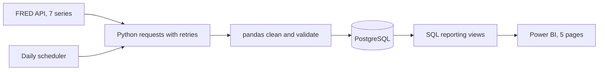

# Banking Economic Conditions Pipeline

I built an automated pipeline that pulls U.S. economic data every day, cleans it, stores it in PostgreSQL, and feeds a five-page Power BI report.

The question behind it is simple. When borrowing costs, the yield curve, inflation, jobs, and credit card delinquencies all move, what does that look like together?

This looks at the national picture. It does not measure any one bank's profits, customers, or deposits.



## What it does

- Pulls 7 series from the FRED API, including the fed funds rate, 2 and 10 year Treasury yields, 30 year mortgage rate, credit card delinquencies, CPI, and unemployment
- Loads only new data each day with a 90 day overlap, and does a full refresh every 30 days to catch revisions
- Retries failed requests, handles pagination, and keeps one bad series from breaking the rest
- Checks for missing values, duplicates, empty responses, and stale data
- Logs every run and blocks two runs from happening at once
- Exposes 7 SQL views and 5 analyses, like how often the yield curve inverts each year and how mortgage rates compare to Treasuries
- Includes an editable Power BI project with five report pages and a drillable date axis
- Ships with a synthetic demo so anyone can try it without an API key

## Tested

23 tests pass against a real PostgreSQL 18 database, and CI runs them on every push. The Power BI files pass Microsoft's JSON schema checks.

Two things I have not verified yet. The report has not been rendered in Power BI Desktop, and I have not done a live run against the FRED API in the build environment. The report opens without cached data, so you refresh it from your own database.

## Tech

Python, pandas, SQL, PostgreSQL, Power BI, Docker, GitHub Actions

## Run it yourself

You need Python 3.11 or newer, Docker Desktop, and Power BI Desktop. For real data you also need a free [FRED API key](https://fred.stlouisfed.org/docs/api/api_key.html). Keep it out of GitHub.

```powershell
git clone https://github.com/Eyobed-Mamo/banking-economic-pipeline.git
cd banking-economic-pipeline
python -m venv .venv
.\.venv\Scripts\python.exe -m pip install -r requirements-dev.txt
Copy-Item .env.example .env
docker compose up -d db
.\.venv\Scripts\python.exe -m etl.pipeline
```

Add your key to `.env` before the last step. Then open `powerbi/Banking.pbip`, set the `Server` parameter to `localhost:5433` and `Database` to `fred_pipeline`, and hit Refresh.

No key yet? Run `python -m etl.demo` against a separate
